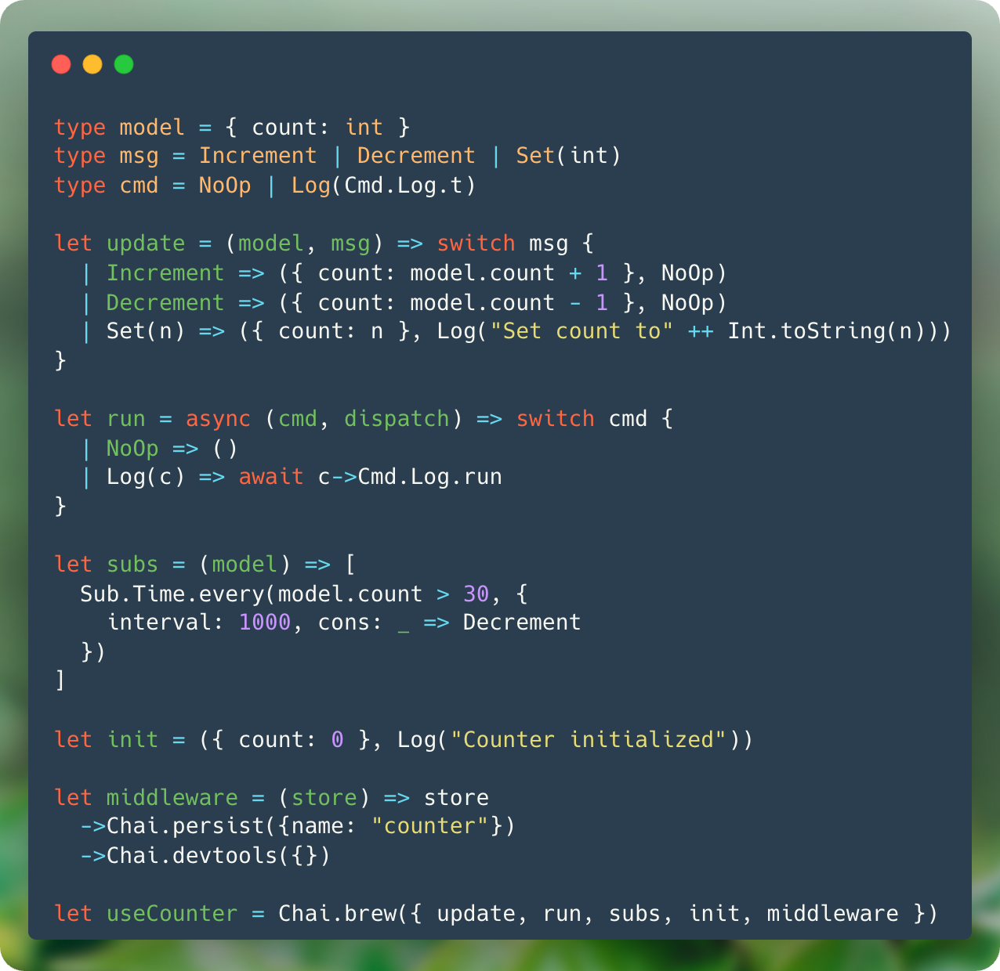

<div style="text-align: center; margin-bottom: 2rem;" align="center">
  
</div>

<h1 style="text-align: center;" align="center"><code>rescript-chai</code></h1>
<div style="text-align: center;" align="center">
  
  &nbsp;&nbsp;&nbsp;
  
  &nbsp;&nbsp;&nbsp;
  
  &nbsp;&nbsp;&nbsp;
  <a href="https://github.com/pmndrs/zustand"></a>
</div>
<p style="text-align: center;" align="center">The Elm Architecture - in ReScript - on React - with Zustand</p>

<div style="display: flex; gap: 0.5rem; margin-bottom: 1rem; justify-content: center; margin-bottom: 4em;" align="center">

  [](https://github.com/elias-michaias/rescript-chai)
  [](https://www.npmjs.com/package/rescript-chai)
  [](https://github.com/elias-michaias/rescript-chai)
  [](https://github.com/elias-michaias/rescript-chai)
</div>
<br/>

>[!WARNING]
>Chai is currently in early development. Some APIs are incomplete, unstable, or subject to change. Do not use Chai in production.
<br/>

<br/>
<h2>What is Chai? 🍵</h2>
<a href="https://github.com/elias-michaias/rescript-chai">Chai</a> is an implementation of <a href="https://guide.elm-lang.org/architecture/">The Elm Architecture</a> (TEA) in <a href="https://rescript-lang.org/">ReScript</a> - built on <a href="https://react.dev/">React</a> and <a href="https://github.com/pmndrs/zustand">zustand 🐻</a>. Chai wants to make the React ecosystem accessible to the Model-View-Update paradigm, without sacrificing on the comforts you're used to. Model your state, clearly define all state transformations, and represent side effects as data structures.
<br/>
<br/>

Here's an example of a file `Brew.res` that defines the core logic for a Model-View-Update loop:

```rescript
// Brew.res

// Define your model - the state of your component
type model = { count: int }

// Define your messages - events that can change state
type msg = Increment | Decrement | Set(int)

// Define your commands - effects that interact with the world
type cmd = NoOp | Log(Cmd.Log.t)

// The update function - pure, handles all state changes
let update = (model, msg) => switch msg {
  | Increment => ({ count: model.count + 1 }, NoOp)
  | Decrement => ({ count: model.count - 1 }, NoOp)
  | Set(n) => ({ count: n }, Log("Set count to" ++ string_of_int(n)))
}

// Handle your side effects (HTTP, storage, timers, etc.)
// Delegate to Chai runtime defaults (Cmd.Log.run) or make your own
// (Swap out runners for test and production environments!)
let run = async (cmd, dispatch) => switch cmd {
  | NoOp => ()
  | Log(c) => await c->Cmd.Log.run
}

// Subscriptions for external events (WebSocket, timers, etc.)
let subs = (model) => [
    // while condition true, do ...
    Sub.Time.every(model.count < 30, {
        interval: 1000, 
        cons: _ => Increment,
    })
]

// Describe the initial state and effects
let init = (
    {
      count: 0
    }, 
    Log("Counter initialized")
)

// Use zustand middleware or make your own!
// Compatible with redux devtools :)
// https://github.com/reduxjs/redux-devtools
let middleware = (store) => store
    ->Chai.persist({name: "counter"})
    ->Chai.devtools({})

// Wire everything together!
let useCounter = Chai.brew({ 
    update, run, subs, init, middleware, opts: {
        // Undo/Redo/Reset functionality
        chrono: { enabled: true }
    }
})
```

After you've created your hook, you can then use it anywhere you want.
The generated hook is idempotent and will never re-run effects. You can safely call it from any component to access the core loop's state:

```rescript
// Counter.res
open Chai

@react.component
let make = () => {
  // `useCounter` is idempotent - 
  // use this hook anywhere to tap into the core MVU loop
  // without fear of re-running effects
  let (state, dispatch, _) = Brew.useCounter()

  <div>
    <h2>{React.string(state.title)}</h2>
    <p>{React.string("Count: " ++ Int.toString(state.count))}</p>
    <button onClick={_ => Increment->dispatch}> 
      {React.string("Inc")} 
    </button>
  </div>
}
```

Because Chai uses Zustand under the hood, granular reactivity has never been easier. `select` delegates to Zustand and only re-renders when the selected projection changes.

<h2>Installation 🚀</h2>

```bash
npm install rescript-chai
```

<h2>Reference 📖</h2>

<h3>
<a href="https://github.com/elias-michaias/rescript-chai/blob/main/reference/philosophy.md">
    Philosophy →
</a>
</h3>

<h3>
<a href="https://github.com/elias-michaias/rescript-chai/blob/main/reference/structure.md">
    Structure →
</a>
</h3>

<h3>
<a href="https://github.com/elias-michaias/rescript-chai/blob/main/reference/middleware.md">
    Middleware →
</a>
</h3>

<h3>
<a href="https://github.com/elias-michaias/rescript-chai/tree/main/examples/counter">
    Examples →
</a>
</h3>

<h3>
<a href="https://github.com/elias-michaias/rescript-chai/blob/main/LICENSE">
    License →
</a>
</h3>