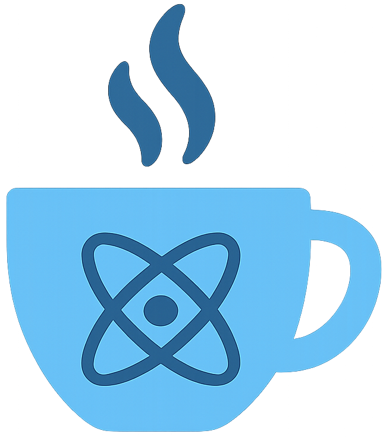

# Chai

<div style="text-align: center; margin-bottom: 2rem;" align="center">
  
</div>

<h2 style="text-align: center;"><code>rescript-chai</code></h2>

<p style="text-align: center; max-width: 600px; margin: 0 auto 2rem auto;">
<a href="https://github.com/elias-michaias/rescript-chai">Chai</a> is an implementation of <a href="https://guide.elm-lang.org/architecture/">The Elm Architecture</a> (TEA) in <a href="https://rescript-lang.org/">ReScript</a> - built on <a href="https://react.dev/">React</a>. Chai wants to make the React ecosystem accessible to the Model-View-Update paradigm, without sacrificing on the comforts you're used to.
</p>

>[!WARNING]
>Chai is an experimental project and is currently in early development. Most APIs are incomplete, unstable, and subject to change.

## Philosophy

Chai wants to give developers the ability to utilize all of the application hygiene that The Elm Architecture provides for building user interfaces: pure functions handling updates, centralized state transformations, and declarative side-effects represented as data structures. This approach eliminates many common sources of bugs and makes applications easier to reason about and test. On the other hand, React has a vast ecosystem of incredibly high-quality component libraries and specialized SDKs.

Chai seeks to bridge this gap by solving two issues:
1. Building the MVU loop's reactivity around React as a base.
2. Allowing the core MVU loop to seamlessly embed React components. 

The `useKettle` hook provides the MVU loop and state transformation mechanism, while `useCup` enables the Kettle to "pour" out segregated portions of its model and message-passing, similar to the traditional `lens` in Elm. Since React remains under the hood, developers retain the flexibility to use traditional React patterns when needed.

ReScript seems to be an excellent host language for this approach. The combination of first-class React support, JSX as a language-level syntax, and a strong preference for immutability and pattern matching, leads to an ideal environment for concocting such an experiment. 

## Structure

Chai does not srictly enforce any particular module pattern, but the below application structure is the vision that Chai has in mind for optimally reducing tension between The Elm Architecture and React's Component Model:

```
src/
-> Brew.res
-> Kettle.res
-> components/
    -> Cup.res 
    -> ...
```

### Brew
The `Brew` is the home of the MVU loop's core logic. Here lies the traditional TEA staples:
`model`, `msg`, `cmd`, `subs`, etc. A Brew can have multiple peer Brews, such as for handling multiple routes, but one Brew should never be dependent upon another.

### Kettle
The `Kettle` is the "mother component" at the top-level (or second to a minimal "App" root component). It can have peer Kettles, such as for handling multiple routes, but a Kettle is never a child of another Kettle. The Kettle is responsible for reifying the Brew core logic, for rendering the top-level view, as well as instantiating all child components. 

### Cup
The `Cup` is a "sub-component" for all intents and purposes. A Cup only receives a segregated portion of the model and message-passing from its parent Kettle. This eliminates errors in which a Cup rendering a sidebar could accidentally alter the state for a navbar. If you were going to import a React component library that exposes all intra-component state as props, such as `shadcn/ui` or `mui`, all of these components would be Cups.

## Example

```rescript
// Brew.res
type model = {
    count: int
}

type msg = 
  | Increment 
  | Decrement
  | Set(option<int>)
  | SendData(string)

type cmd = 
  | NoOp 
  | Log(Cmd.Log.t) 
  | WebSocket(Cmd.WebSocket.t<msg>)

let update = (model, msg) => switch msg {
  | Increment => ({count: model.count + 1}, NoOp)
  | Decrement => ({count: model.count - 1}, NoOp)
  | Set(Some(n)) => ({count: n}, NoOp)
  | Set(None) => (model, NoOp)
  | SendData(data) => (model, WebSocket({
    url: "wss://echo.websocket.org",
    data: data,
  }))
}

let run = async (cmd, dispatch) => switch cmd {
  | NoOp => ()
  | Log(c) => await c->Cmd.Log.run
  | WebSocket(c) await c->Cmd.WebSocket.run(dispatch)
}

let init = (count) => {
    ({
        count: count
    }, 
        Log("Counter initialized")
    )
}

let subs = (_model) => [
    Sub.WebSocket.listen(
        "wss://echo.websocket.org", 
        s => s
            ->int_of_string
            ->Set
    )
]


// Counter.res
open Brew

@react.component
let make = (~count=0) => {

  let (model, dispatch) = Chai.useKettle({
    update: update,
    run: run,
    subs: subs,
    init: init(count),
  })

  <div>
    <p>{("Count: " ++ string_of_int(model.count))->React.string}</p>
    <button onClick={_ => Increment->dispatch}>
      {"+"->React.string}
    </button>
    <button onClick={_ => Decrement->dispatch}>
      {"-"->React.string}
    </button>
    <button onClick={_ => SendData(9)->dispatch}>
      {"Set to 9 via WebSocket"->React.string}
    </button>
  </div>
}
```
