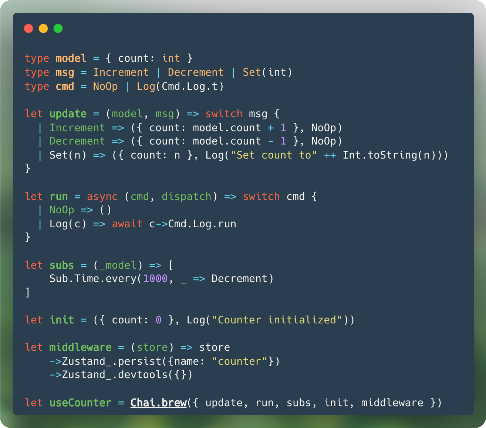

<div style="text-align: center; margin-bottom: 2rem;" align="center">
  
</div>

<h1 style="text-align: center;" align="center"><code>rescript-chai</code></h1>
<div style="text-align: center; display: flex;" align="center">
  <svg role="img" viewBox="0 0 24 24" xmlns="http://www.w3.org/2000/svg"><title>Elm</title><path fill="#1293D8" d="M23.986 12.806V23.2l-5.197-5.197zM6.796 6.01H17.19l-5.197 5.197zm9.275-1.12H5.677L.8.015h10.394zm7.116 7.117L17.99 6.81l-5.197 5.197 5.197 5.197zm.813-.813L12.806 0H24zM0 23.2V.813l11.194 11.194zm23.187.8H.8l11.193-11.194Z"/></svg>
  <svg role="img" viewBox="0 0 24 24" xmlns="http://www.w3.org/2000/svg"><title>ReScript</title><path fill="#E6484F" d="M23.29 1.8c-.3-.4-.6-.7-.9-.9-1.3-.9-2.899-.9-6.098-.9H7.696C4.498 0 2.9 0 1.8.8c-.4.3-.7.6-1 1C0 2.9 0 4.5 0 7.7v8.6c0 3.2 0 4.8.8 5.9.3.4.6.7.9.9 1.199.9 2.798.9 5.996.9h8.596c3.199 0 4.798 0 5.898-.8.4-.3.7-.6.9-.9.799-1.1.799-2.7.799-5.9V7.7c.2-3.2.2-4.8-.6-5.9ZM11.194 16.5c0 .2 0 .5-.1.8 0 .2-.1.3-.1.5-.1.1-.2.3-.4.5s-.4.3-.6.4c-.3.1-.7.1-1.399.1-.8 0-1.1 0-1.4-.1-.4-.2-.699-.5-.899-.9-.1-.3-.1-.7-.1-1.4v-8c0-.9 0-1.4.2-1.7.2-.3.4-.5.8-.7.3-.2.8-.2 1.699-.2h2.299zm5.097-4.9c-1.599 0-2.798-1.3-2.798-2.8 0-1.6 1.3-2.8 2.798-2.8 1.5 0 2.8 1.3 2.8 2.8 0 1.5-1.3 2.8-2.8 2.8z"/></svg>
  <svg role="img" viewBox="0 0 24 24" xmlns="http://www.w3.org/2000/svg"><title>React</title><path fill="#61DAFB" d="M14.23 12.004a2.236 2.236 0 0 1-2.235 2.236 2.236 2.236 0 0 1-2.236-2.236 2.236 2.236 0 0 1 2.235-2.236 2.236 2.236 0 0 1 2.236 2.236zm2.648-10.69c-1.346 0-3.107.96-4.888 2.622-1.78-1.653-3.542-2.602-4.887-2.602-.41 0-.783.093-1.106.278-1.375.793-1.683 3.264-.973 6.365C1.98 8.917 0 10.42 0 12.004c0 1.59 1.99 3.097 5.043 4.03-.704 3.113-.39 5.588.988 6.38.32.187.69.275 1.102.275 1.345 0 3.107-.96 4.888-2.624 1.78 1.654 3.542 2.603 4.887 2.603.41 0 .783-.09 1.106-.275 1.374-.792 1.683-3.263.973-6.365C22.02 15.096 24 13.59 24 12.004c0-1.59-1.99-3.097-5.043-4.032.704-3.11.39-5.587-.988-6.38-.318-.184-.688-.277-1.092-.278zm-.005 1.09v.006c.225 0 .406.044.558.127.666.382.955 1.835.73 3.704-.054.46-.142.945-.25 1.44-.96-.236-2.006-.417-3.107-.534-.66-.905-1.345-1.727-2.035-2.447 1.592-1.48 3.087-2.292 4.105-2.295zm-9.77.02c1.012 0 2.514.808 4.11 2.28-.686.72-1.37 1.537-2.02 2.442-1.107.117-2.154.298-3.113.538-.112-.49-.195-.964-.254-1.42-.23-1.868.054-3.32.714-3.707.19-.09.4-.127.563-.132zm4.882 3.05c.455.468.91.992 1.36 1.564-.44-.02-.89-.034-1.345-.034-.46 0-.915.01-1.36.034.44-.572.895-1.096 1.345-1.565zM12 8.1c.74 0 1.477.034 2.202.093.406.582.802 1.203 1.183 1.86.372.64.71 1.29 1.018 1.946-.308.655-.646 1.31-1.013 1.95-.38.66-.773 1.288-1.18 1.87-.728.063-1.466.098-2.21.098-.74 0-1.477-.035-2.202-.093-.406-.582-.802-1.204-1.183-1.86-.372-.64-.71-1.29-1.018-1.946.303-.657.646-1.313 1.013-1.954.38-.66.773-1.286 1.18-1.868.728-.064 1.466-.098 2.21-.098zm-3.635.254c-.24.377-.48.763-.704 1.16-.225.39-.435.782-.635 1.174-.265-.656-.49-1.31-.676-1.947.64-.15 1.315-.283 2.015-.386zm7.26 0c.695.103 1.365.23 2.006.387-.18.632-.405 1.282-.66 1.933-.2-.39-.41-.783-.64-1.174-.225-.392-.465-.774-.705-1.146zm3.063.675c.484.15.944.317 1.375.498 1.732.74 2.852 1.708 2.852 2.476-.005.768-1.125 1.74-2.857 2.475-.42.18-.88.342-1.355.493-.28-.958-.646-1.956-1.1-2.98.45-1.017.81-2.01 1.085-2.964zm-13.395.004c.278.96.645 1.957 1.1 2.98-.45 1.017-.812 2.01-1.086 2.964-.484-.15-.944-.318-1.37-.5-1.732-.737-2.852-1.706-2.852-2.474 0-.768 1.12-1.742 2.852-2.476.42-.18.88-.342 1.356-.494zm11.678 4.28c.265.657.49 1.312.676 1.948-.64.157-1.316.29-2.016.39.24-.375.48-.762.705-1.158.225-.39.435-.788.636-1.18zm-9.945.02c.2.392.41.783.64 1.175.23.39.465.772.705 1.143-.695-.102-1.365-.23-2.006-.386.18-.63.406-1.282.66-1.933zM17.92 16.32c.112.493.2.968.254 1.423.23 1.868-.054 3.32-.714 3.708-.147.09-.338.128-.563.128-1.012 0-2.514-.807-4.11-2.28.686-.72 1.37-1.536 2.02-2.44 1.107-.118 2.154-.3 3.113-.54zm-11.83.01c.96.234 2.006.415 3.107.532.66.905 1.345 1.727 2.035 2.446-1.595 1.483-3.092 2.295-4.11 2.295-.22-.005-.406-.05-.553-.132-.666-.38-.955-1.834-.73-3.703.054-.46.142-.944.25-1.438zm4.56.64c.44.02.89.034 1.345.034.46 0 .915-.01 1.36-.034-.44.572-.895 1.095-1.345 1.565-.455-.47-.91-.993-1.36-1.565z"/></svg>
</div>
<p style="text-align: center;" align="center">The Elm Architecture - in ReScript - on React</p>

<div style="display: flex; gap: 0.5rem; margin-bottom: 1rem; justify-content: center; margin-bottom: 4em;" align="center">

  [](https://www.npmjs.com/package/rescript-chai)
  [](https://github.com/elias-michaias/rescript-chai)
  [](https://github.com/elias-michaias/rescript-chai)
  [](https://opensource.org/licenses/MIT)
</div>
<br/>

>[!WARNING]
>Chai is an experimental project and is currently in early development. Most APIs are incomplete, unstable, and subject to change. Do not use Chai in production.
<br/>

<br/>
<h2>What is Chai? 🍵</h2>
<a href="https://github.com/elias-michaias/rescript-chai">Chai</a> is an implementation of <a href="https://guide.elm-lang.org/architecture/">The Elm Architecture</a> (TEA) in <a href="https://rescript-lang.org/">ReScript</a> - built on <a href="https://react.dev/">React</a>. Chai wants to make the React ecosystem accessible to the Model-View-Update paradigm, without sacrificing on the comforts you're used to. Model your state, clearly define all state transformations, and represent side effects as data structures.
<br/>
<br/>

```rescript
// Define your model - the state of your component
type model = { count: int }

// Define your messages - events that can change state
type msg = Increment | Decrement | Set(int)

// Define your commands - effects that interact with the world
type cmd = NoOp | Log(Cmd.Log.t)

// The update function - pure, handles all state changes
let update = (model, msg) => switch msg {
  | Increment => ({ count: model.count + 1 }, NoOp)
  | Decrement => ({ count: model.count - 1 }, NoOp)
  | Set(n) => ({ count: n }, Log("Set count to" ++ string_of_int(n)))
}

// Handle your side effects (HTTP, storage, timers, etc.)
let run = async (cmd, dispatch) => switch cmd {
  | NoOp => ()
  | Log(c) => await c->Cmd.Log.run
}

// Subscriptions for external events (WebSocket, timers, etc.)
let subs = (_model) => [
    Sub.Time.every(1000, _ => Decrement)
]

// Describe the initial state and effects
let init = (count) => ({
    count: count
}, Log("Counter initialized"))

// Wire everything together!
@react.component
let make = (~count=12) => {
  let (model, dispatch) = Chai.useKettle({
    update: update,
    run: run,
    subs: subs,
    init: init(count),
  })

  <div>
    <p>{React.string("Count: " ++ string_of_int(model.count))}</p>
    <button onClick={_ => Increment->dispatch}>
      {React.string("Increment")}
    </button>
  </div>
}
```

<h2>Installation</h2>

```bash
npm install rescript-chai
```

<h2>Reference</h2>

<h3>
<a href="https://github.com/elias-michaias/rescript-chai/blob/main/reference/philosophy.md">
    Philosophy →
</a>
</h3>

<h3>
<a href="https://github.com/elias-michaias/rescript-chai/blob/main/reference/structure.md">
    Structure →
</a>
</h3>

<h3>
<a href="https://github.com/elias-michaias/rescript-chai/tree/main/examples/counter">
    Examples →
</a>
</h3>

<h3>
<a href="https://github.com/elias-michaias/rescript-chai/blob/main/LICENSE">
    License →
</a>
</h3>